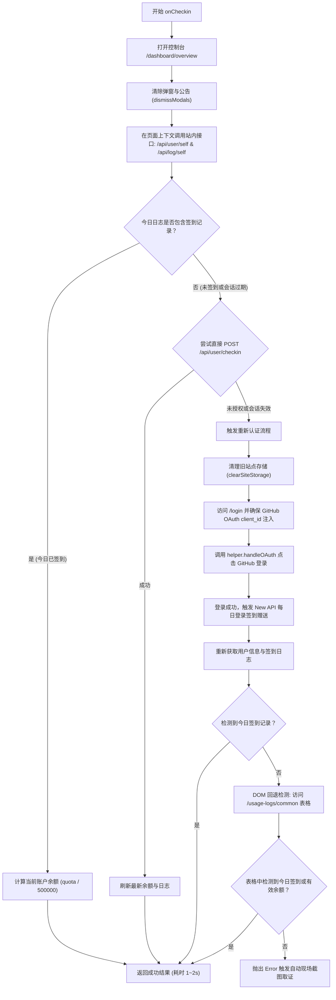

# JustDoWork (api.justwoker.icu) 自动签到插件设计规范

## 1. 概述与背景

JustDoWork (`https://api.justwoker.icu`) 是一个基于 New API (v1.0.0-rc.23) 搭建的 AI API 分发网关系统。
该系统支持每日签到获取额度奖励（`checkin_enabled: true`），且在用户通过 GitHub OAuth 登录时可自动触发每日签到发放。
本插件旨在将 JustDoWork 纳入 `checkin-hub` 统一管理，支持每日自动打卡巡检、额度查询与 `--setup` 交互式初始化。

## 2. 插件核心契约

- **文件路径**：`plugins/justdowork.js`
- **继承基类**：`BasePlugin` (`core/base-plugin.js`)
- **Plugin ID**：`justdowork`
- **Plugin Name**：`JustDoWork`
- **描述**：`JustDoWork 每日自动签到与额度查询`
- **目标主页 URL**：`https://api.justwoker.icu/dashboard/overview`
- **登录 URL**：`https://api.justwoker.icu/login`
- **日志 URL**：`https://api.justwoker.icu/usage-logs/common`
- **额度换算比例**：`QUOTA_PER_USD = 500_000`（1 USD = 500,000 Quota）
- **授权域名列表**：`['api.justwoker.icu']`

## 3. 架构设计与执行流程



## 4. 详细模块设计

### 4.1 数据查询 (`fetchUserData`)

在已注入凭证的页面上下文中执行：

1. 从 `localStorage.getItem('user')` 中提取用户 ID，组织请求头 `{ 'New-Api-User': String(userObj.id) }`。
2. 并发/顺序调用：
   - `GET /api/user/self`：获取当前用户信息及 `data.quota`。
   - `GET /api/log/self?p=1&page_size=10`：获取最近日志列表。
3. 容错处理：若接口异常则安全降级返回 `null`。

### 4.2 今日签到判定 (`findTodayCheckin`)

1. 通过 `helper.getCSTDateString(item.created_at * 1000)` 获取每条日志的中国标准时间（UTC+8）日期。
2. 对比当前东八区日期 `helper.getCSTDateString()`。
3. 判断内容中是否包含 `"用户签到"`、`"签到"` 或 `"每日"`。

### 4.3 Setup 模式 (`onSetup`)

1. 访问 `https://api.justwoker.icu/login`。
2. 提示用户在弹出的浏览器中手动完成 GitHub 登录。
3. 严格使用 Predicate 等待跳转离开登录页：
   ```javascript
   await page.waitForURL(
     (url) => {
       const p = url.pathname;
       return (
         !p.includes('/login') &&
         (p.includes('/dashboard') || p.includes('/usage-logs') || p.includes('/console'))
       );
     },
     { timeout: 300000, waitUntil: 'domcontentloaded' }
   );
   ```

### 4.4 异常处理与 Playwright 八项铁律遵循

1. **严格选择器**：全部定位符均使用 `.first()` 约束，防止多元素命中报错。
2. **零硬编码睡眠**：仅使用显式状态等待（`waitFor({ state: 'visible' })`）与 Predicate URL 等待。
3. **安全凭证隔离**：Cookie 清理仅清理非 Cloudflare/WAF 凭证，保留安全验证态。
4. **失败截图**：遇到签到异常直接抛出 `new Error(...)`，自动在 `screenshots/justdowork-<timestamp>.png` 留痕。

## 5. 验证标准

1. `npm run check` 运行通过，ESLint 与插件契约扫描 0 错误。
2. `node index.js --list` 成功发现并注册 `justdowork`。
